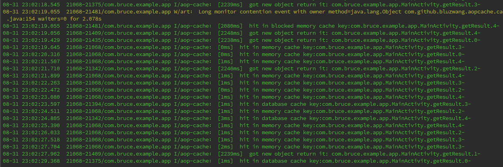

# aop-cache
 aop-cache is a light weight [easy-using](#benchmark-results) cache library for android with [rxjava](https://github.com/ReactiveX/RxJava).
 Just add ONE LINE to make cache.
#### Usage
---
 add @Cache to the function that returns Observable<>.
```java
@Cache(memTimeOutMs = 5000, dbTimeOutMs = 10000, logLevel = 1)
private Observable<String> getResult(int i) {
    return Observable.just(i)
            .map(new Func1<Integer, String>() {
                @Override
                public String call(Integer integer) {
                    StringBuffer buffer = new StringBuffer();
                    try {
                        Thread.sleep(2222);
                    } catch (InterruptedException e) {
                        e.printStackTrace();
                    }
                    for (int j = 0; j < 10; j++) {
                        buffer.append(integer);
                    }
                    return buffer.toString();
                }
            });
}
```

 and call this @Cache function as usual.
```java
final Random random = new Random();
findViewById(R.id.btn).setOnClickListener(new View.OnClickListener() {
    @Override
    public void onClick(View view) {
        int nextInt = random.nextInt(5);
        final long startTime = System.currentTimeMillis();
        getResult(nextInt)
                .subscribeOn(Schedulers.io())
                .observeOn(AndroidSchedulers.mainThread())
                .subscribe(new Action1<String>() {
                    @DebugTrace
                    @Override
                    public void call(String s) {
                        long usingTime = System.currentTimeMillis() - startTime;
                        String msg;
                        msg = s + " using time " + usingTime;
                        tv.append("\n");
                        if (usingTime > 2222) {
                            tv.append(Html.fromHtml("<font color=\"#ff0000\">"+ msg +"</font>")) ;
                        } else {
                            tv.append(msg);
                        }
                        sv.fullScroll(ScrollView.FOCUS_DOWN);
                    }
                });
    }
}
```
 the result


#### Add dependency
-----
```groovy
repositories {
    jcenter()
}
dependencies {
    ...
    compile 'com.github.bluzwang:aopcache:0.9.5'
    compile 'org.aspectj:aspectjrt:1.8.1'
}
```
Also add these to the end of app/grade.build.

```groovy
import org.aspectj.bridge.IMessage
import org.aspectj.bridge.MessageHandler
import org.aspectj.tools.ajc.Main

final def log = project.logger
final def variants = project.android.applicationVariants

variants.all { variant ->
    if (!variant.buildType.isDebuggable()) {
        log.debug("Skipping non-debuggable build type '${variant.buildType.name}'.")
        return;
    }

    JavaCompile javaCompile = variant.javaCompile
    javaCompile.doLast {
        String[] args = ["-showWeaveInfo",
                         "-1.5",
                         "-inpath", javaCompile.destinationDir.toString(),
                         "-aspectpath", javaCompile.classpath.asPath,
                         "-d", javaCompile.destinationDir.toString(),
                         "-classpath", javaCompile.classpath.asPath,
                         "-bootclasspath", project.android.bootClasspath.join(File.pathSeparator)]
        log.debug "ajc args: " + Arrays.toString(args)

        MessageHandler handler = new MessageHandler(true);
        new Main().run(args, handler);
        for (IMessage message : handler.getMessages(null, true)) {
            switch (message.getKind()) {
                case IMessage.ABORT:
                case IMessage.ERROR:
                case IMessage.FAIL:
                    log.error message.message, message.thrown
                    break;
                case IMessage.WARNING:
                    log.warn message.message, message.thrown
                    break;
                case IMessage.INFO:
                    log.info message.message, message.thrown
                    break;
                case IMessage.DEBUG:
                    log.debug message.message, message.thrown
                    break;
            }
        }
    }
}
```

